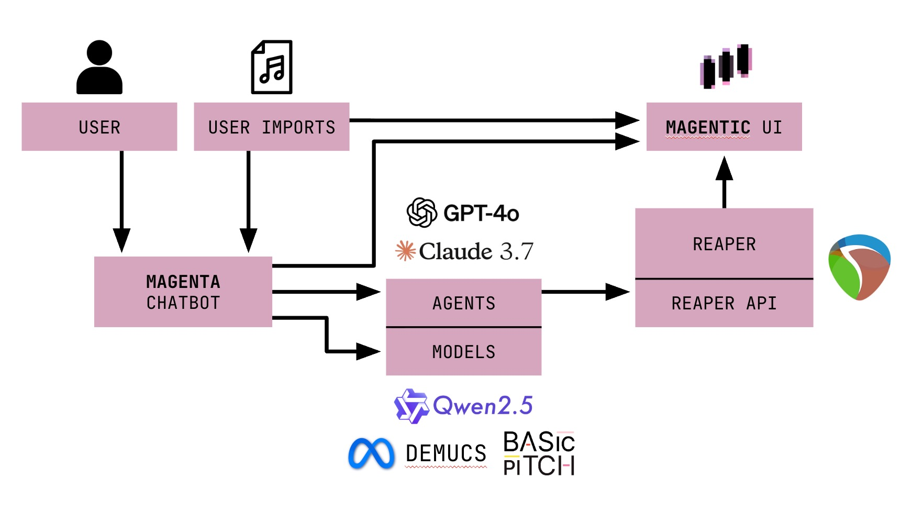

<p align="center">
  
</p>

<h1 align="center">Magentic</h1>

<p align="center">
  AI-powered music production assistant for REAPER
</p>

---

## Why Magentic?

Music production has a steep learning curve, especially in powerful DAWs like REAPER. Beginners often know what they want to hear — something like a "house beat" — but don't yet know what that means: a four-on-the-floor kick, a clap on 2 and 4, and off-beat hi-hats. And even if they do, they may not know how to build it inside the DAW.

That gap between musical instinct and technical execution is where most people get stuck.

AI coding assistants have transformed software development — not by replacing engineers, but by helping them move faster and learn as they build. Music production hasn't had that kind of support. **We built Magentic to change that.**

### What it does

- **Control REAPER directly** — Create tracks, add MIDI patterns, apply FX chains, adjust mixing parameters, and more — all from natural-language commands executed instantly in your session.
- **AI Stem Separation + MIDI Conversion** — Upload any track, split it into drums, bass, vocals, and more using **Demucs** (open-source, originally by Meta), then convert those stems to MIDI using **Basic Pitch** (open-source, by Spotify) so you can reuse and reinterpret the original musical ideas directly inside REAPER.
- **Manage FX presets** — Browse, switch, and apply FX presets on any track through chat.
- **Stay project-aware** — Magentic reads your live REAPER session (tracks, FX, items, BPM, duration) and gives context-specific responses referencing your actual project state.

---

## Architecture & Workflow

<p align="center">
  
</p>

**Frontend** — React + Vite with a custom dark magenta UI, sleek styling, smooth animations, and an intuitive split-panel layout (file upload, project details, and main chat panel).

**Backend** — Node.js + Express API server using OpenAI's **GPT-4o** and Anthropic's **Claude 3.7** with structured function-calling tools — not just prompt engineering, but a full agentic loop. The AI can call **40+ production tools** (create tracks, generate MIDI, apply FX, separate stems, convert audio to MIDI, etc.) and chain them together into multi-step workflows.

**Python Bridge** — A FastAPI-based bridge server connected to REAPER via the **reapy** library. Tool calls are translated into live DAW modifications, giving Magentic real-time read/write access to the full session.

**ML Models (via Modal)** — Two open-source ML models are integrated into the workflow and run on GPU via [Modal](https://modal.com):

| Model | Source | Purpose |
|-------|--------|---------|
| **Demucs** (htdemucs) | Meta / Facebook Research | AI-powered source separation — splits any audio track into drums, bass, vocals, and other stems |
| **Basic Pitch** (ONNX) | Spotify | Audio-to-MIDI transcription — converts audio stems into MIDI note data so users can study and reinterpret musical ideas |

**Reasoning** — An optional reasoning layer using **Qwen 2.5** (served via Modal on A100 GPUs) provides a dedicated planning step for complex, multi-tool production requests before execution.

```
User ──► React Frontend ──► Express Backend ──► Python Bridge ──► REAPER
              │                    │
              │              GPT-4o / Claude 3.7
              │              (40+ tool schemas)
              │                    │
              │              Modal GPU Endpoints
              │              ├─ Demucs (stem separation)
              │              ├─ Basic Pitch (audio → MIDI)
              │              └─ Qwen 2.5 (reasoning)
              │                    │
              └────────────────────┘
                   responses + tool results
```

---

## Project Structure

```
Magentic/
├── bridge/              Python FastAPI bridge (REAPER via reapy) — port 5001
│   └── main.py
├── backend/             Express + OpenAI/Anthropic API — port 3001
│   ├── server.js
│   ├── agent/           AI system prompt, tools, Anthropic client
│   ├── orchestrator/    Intent routing (direct vs. plan)
│   ├── musicPlan/       Reasoning model planner client
│   ├── routes/          API routes (chat, files, functions)
│   └── lib/             Supabase client, file store, music theory
├── planner/             Modal serverless functions
│   ├── modal_planner.py     Qwen 2.5 reasoning model
│   └── modal_functions.py   Demucs + Basic Pitch GPU endpoints
└── frontend/            React (Vite) — port 5173
    └── src/
```

---

## Installation

### Prerequisites

- [REAPER](https://www.reaper.fm/) installed and open
- [reapy](https://github.com/RomeoDespworktrees/reapy) configured (Python REAPER API)
- Node.js 18+
- Python 3.10+
- An OpenAI API key (required)
- An Anthropic API key (optional, used as fallback when OpenAI rate-limits)
- A Supabase project with a `magentic-files` storage bucket (for persistent file/stem/MIDI storage)

### 1. Bridge (REAPER control)

The bridge is a FastAPI server that connects to REAPER via reapy. It must be running for any DAW interaction to work.

```bash
cd bridge
pip install fastapi uvicorn python-reapy pydantic
python main.py
```

> The bridge starts on port **5001**. Make sure REAPER is open before starting it. If you see `reapy` connection errors, run `python -c "import reapy; reapy.configure_reaper()"` first to enable the REAPER API.

### 2. Backend

```bash
cd backend
cp .env.example .env
npm install
npm run dev
```

Edit `.env` with your keys:

```env
OPENAI_API_KEY=sk-your-key
ANTHROPIC_API_KEY=sk-ant-your-key          # optional — Claude fallback

SUPABASE_URL=https://your-project.supabase.co
SUPABASE_SERVICE_KEY=your-service-role-key

# ML Functions (see Limitations below)
FUNCTIONS_PROVIDER=modal
FUNCTIONS_MODAL_URL=https://your-modal-url.modal.run

# Reasoning model
REASONING_PROVIDER=openai                  # or 'modal' for Qwen 2.5
```

### 3. Frontend

```bash
cd frontend
npm install
npm run dev
```

### Start order

```
1. Open REAPER
2. bridge/    →  python main.py
3. backend/   →  npm run dev
4. frontend/  →  npm run dev
```

Open **http://localhost:5173** — chatbot on the right, import panel and project state on the left.

---

## Current Limitations

1. **Reasoning model** — The Qwen 2.5 reasoning model (served via Modal) does not yet produce reliable enough plans for complex multi-step production tasks. For now, the system defaults to OpenAI (`gpt-4o`) for both direct execution and planning.

2. **Modal GPU endpoints disabled** — As of February 16, 2026, the Modal GPU endpoints for Demucs (stem separation), Basic Pitch (audio-to-MIDI), and QWEN (planning) have been disabled. Users will **not** be able to run stem separation or audio-to-MIDI conversion until the endpoints are re-deployed. To re-enable, deploy the Modal functions:

   ```bash
   cd planner
   modal deploy modal_functions.py
   ```

   Then set `FUNCTIONS_MODAL_URL` in `backend/.env` to the deployed URL.

---


